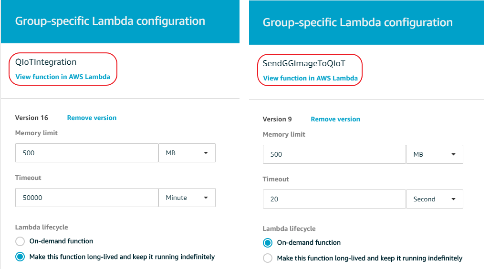

# Tutorial to setup Image prediction using AWS Greengrass + QIoT + QuAI using Raspberry Pi

## Example Scenarios to predict captures image from Raspberry Pi

- AWS GG device --> AWS GG Core --> QIoT --> QuAI --> AWS GG Core Lambda --> AWS Cloud --> S3 bucket
- QIoT device --> QIoT --> QuAI --> AWS GG Core Lambda --> AWS Cloud --> S3 bucket

### Scenario1: AWS GG device --> AWS GG Core --> QIoT --> QuAI --> AWS GG Core Lambda --> AWS Cloud --> S3 bucket

#### How to setup?

- Prepare AWS Greengrass
- Setup AWS GG Device
- Setup QIoT
- Setup QuAI
- Setup AWS cloud S3 bucket & Lambda function
- Start the demo

#### Prepare AWS Greengrass
1.  Install AWS Greengrass App in QNAP NAS from App center

2.  Setup your AWS Greengrass Group & Core in QNAP AWS Greengrass App. Please refer this link for more details https://qiot.qnap.com/blog/en/2018/01/17/setup-greengrass-qnap-nas/
3.  Create two Lambda function as shown in the below image and update it's configuration setting's Memeory limit and timeout. Please find Demo Lambda source codes inside <> folder


4.  Create a new device inside Greengrass Group Devices section as shown in the below image

5.  Prepare below 3 subscriptions list
  - Greengrass Device to SendGGImageToQIoT:9 Lambda for Image Prediction
  - QIoTIntegration Lambda function to IoT Cloud for upload predicted image to S3 Bucket
  - Greengrass Device to QIoTIntegration:16 Lmabda for republish QIoT predcited message to  AWS Greengrass then to AWS Cloud.

  Please refer the following image for these 3 subscriptions list source, destination and topic details
  
6. Deploy the Greengrass Group.
  

#### Setup AWS GG Device
1. Deploy the capture image source code from <> folder to Raspberry Pi
2. Setup the camera in Raspberry Pi device and start the program by executing the following command
___python send_image_AWSGG.py -e <host>.iot.<region>.amazonaws.com -r root.ca.pem -c <GG_Camrea_Cert_pem_file> -k GG_Camrea_Cert_private_key_file -n GG_Camera -m publish -t "cameraImage"___
  
# Editor.md


     


**Table of Contents**

[TOCM]

[TOC]

#H1 header
##H2 header
###H3 header
####H4 header
#####H5 header
######H6 header
#Heading 1 link [Heading link](https://github.com/pandao/editor.md "Heading link")
##Heading 2 link [Heading link](https://github.com/pandao/editor.md "Heading link")
###Heading 3 link [Heading link](https://github.com/pandao/editor.md "Heading link")
####Heading 4 link [Heading link](https://github.com/pandao/editor.md "Heading link") Heading link [Heading link](https://github.com/pandao/editor.md "Heading link")
#####Heading 5 link [Heading link](https://github.com/pandao/editor.md "Heading link")
######Heading 6 link [Heading link](https://github.com/pandao/editor.md "Heading link")

##Headers (Underline)

H1 Header (Underline)
=============

H2 Header (Underline)
-------------

###Characters
                
----

~~Strikethrough~~ <s>Strikethrough (when enable html tag decode.)</s>
*Italic*      _Italic_
**Emphasis**  __Emphasis__
***Emphasis Italic*** ___Emphasis Italic___

Superscript: X<sub>2</sub>，Subscript: O<sup>2</sup>

**Abbreviation(link HTML abbr tag)**

The <abbr title="Hyper Text Markup Language">HTML</abbr> specification is maintained by the <abbr title="World Wide Web Consortium">W3C</abbr>.

###Blockquotes

> Blockquotes

Paragraphs and Line Breaks
                    
> "Blockquotes Blockquotes", [Link](http://localhost/)。

###Links

[Links](http://localhost/)

[Links with title](http://localhost/ "link title")

`<link>` : <https://github.com>

[Reference link][id/name] 

[id/name]: http://link-url/

GFM a-tail link @pandao

###Code Blocks (multi-language) & highlighting

####Inline code

`$ npm install marked`

####Code Blocks (Indented style)

Indented 4 spaces, like `<pre>` (Preformatted Text).

    <?php
        echo "Hello world!";
    ?>
    
Code Blocks (Preformatted text):

    | First Header  | Second Header |
    | ------------- | ------------- |
    | Content Cell  | Content Cell  |
    | Content Cell  | Content Cell  |

####Javascript　

```javascript
function test(){
    console.log("Hello world!");
}
 
(function(){
    var box = function(){
        return box.fn.init();
    };

    box.prototype = box.fn = {
        init : function(){
            console.log('box.init()');

            return this;
        },

        add : function(str){
            alert("add", str);

            return this;
        },

        remove : function(str){
            alert("remove", str);

            return this;
        }
    };
    
    box.fn.init.prototype = box.fn;
    
    window.box =box;
})();

var testBox = box();
testBox.add("jQuery").remove("jQuery");
```

####HTML code

```html
<!DOCTYPE html>
<html>
    <head>
        <mate charest="utf-8" />
        <title>Hello world!</title>
    </head>
    <body>
        <h1>Hello world!</h1>
    </body>
</html>
```

###Images

Image:


> Follow your heart.


> 图为：厦门白城沙滩 Xiamen

图片加链接 (Image + Link)：

[](https://pandao.github.io/editor.md/examples/images/7.jpg "李健首张专辑《似水流年》封面")

> 图为：李健首张专辑《似水流年》封面
                
----

###Lists

####Unordered list (-)

- Item A
- Item B
- Item C
     
####Unordered list (*)

* Item A
* Item B
* Item C

####Unordered list (plus sign and nested)
                
+ Item A
+ Item B
    + Item B 1
    + Item B 2
    + Item B 3
+ Item C
    * Item C 1
    * Item C 2
    * Item C 3

####Ordered list
                
1. Item A
2. Item B
3. Item C
                
----
                    
###Tables
                    
First Header  | Second Header
------------- | -------------
Content Cell  | Content Cell
Content Cell  | Content Cell 

| First Header  | Second Header |
| ------------- | ------------- |
| Content Cell  | Content Cell  |
| Content Cell  | Content Cell  |

| Function name | Description                    |
| ------------- | ------------------------------ |
| `help()`      | Display the help window.       |
| `destroy()`   | **Destroy your computer!**     |

| Item      | Value |
| --------- | -----:|
| Computer  | $1600 |
| Phone     |   $12 |
| Pipe      |    $1 |

| Left-Aligned  | Center Aligned  | Right Aligned |
| :------------ |:---------------:| -----:|
| col 3 is      | some wordy text | $1600 |
| col 2 is      | centered        |   $12 |
| zebra stripes | are neat        |    $1 |
                
----

####HTML entities

&copy; &  &uml; &trade; &iexcl; &pound;
&amp; &lt; &gt; &yen; &euro; &reg; &plusmn; &para; &sect; &brvbar; &macr; &laquo; &middot; 

X&sup2; Y&sup3; &frac34; &frac14;  &times;  &divide;   &raquo;

18&ordm;C  &quot;  &apos;

##Escaping for Special Characters

\*literal asterisks\*

##Markdown extras

###GFM task list

- [x] GFM task list 1
- [x] GFM task list 2
- [ ] GFM task list 3
    - [ ] GFM task list 3-1
    - [ ] GFM task list 3-2
    - [ ] GFM task list 3-3
- [ ] GFM task list 4
    - [ ] GFM task list 4-1
    - [ ] GFM task list 4-2

###Emoji mixed :smiley:

> Blockquotes :star:

####GFM task lists & Emoji & fontAwesome icon emoji & editormd logo emoji :editormd-logo-5x:

- [x] :smiley: @mentions, :smiley: #refs, [links](), **formatting**, and <del>tags</del> supported :editormd-logo:;
- [x] list syntax required (any unordered or ordered list supported) :editormd-logo-3x:;
- [x] [ ] :smiley: this is a complete item :smiley:;
- [ ] []this is an incomplete item [test link](#) :fa-star: @pandao; 
- [ ] [ ]this is an incomplete item :fa-star: :fa-gear:;
    - [ ] :smiley: this is an incomplete item [test link](#) :fa-star: :fa-gear:;
    - [ ] :smiley: this is  :fa-star: :fa-gear: an incomplete item [test link](#);
            
###TeX(LaTeX)
   
$$E=mc^2$$

Inline $$E=mc^2$$ Inline，Inline $$E=mc^2$$ Inline。

$$\(\sqrt{3x-1}+(1+x)^2\)$$
                    
$$\sin(\alpha)^{\theta}=\sum_{i=0}^{n}(x^i + \cos(f))$$
                
###FlowChart

```flow
st=>start: Login
op=>operation: Login operation
cond=>condition: Successful Yes or No?
e=>end: To admin

st->op->cond
cond(yes)->e
cond(no)->op
```

###Sequence Diagram
                    
```seq
Andrew->China: Says Hello 
Note right of China: China thinks\nabout it 
China-->Andrew: How are you? 
Andrew->>China: I am good thanks!
```

###End
